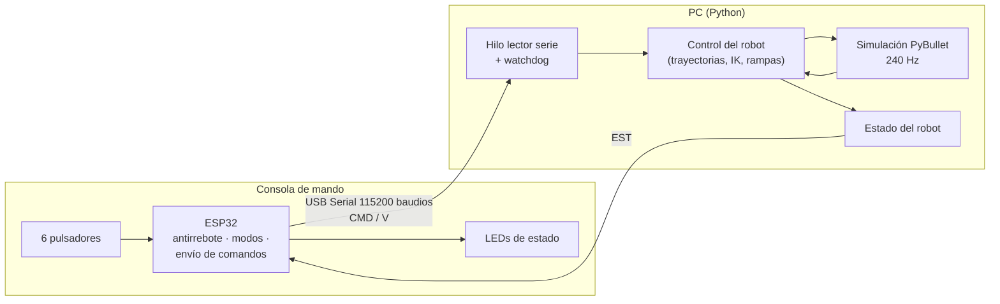
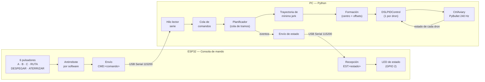
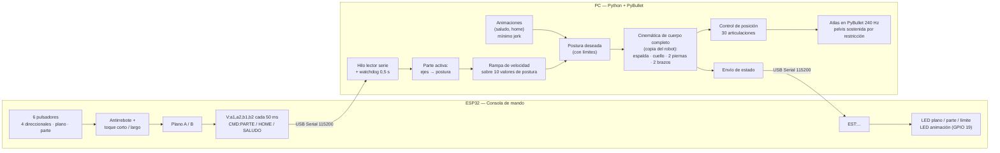

# Taller Segundo Corte 

Control de robots simulados en **PyBullet** mediante una consola de mando construida con una **ESP32** y 6 pulsadores, comunicada con el PC por **Serial USB**.

## Descripción del taller

| Punto | Enunciado | Solución desarrollada |
|---|---|---|
| [a](#punto-a--enjambre-de-drones-a--b--c) | Mover los drones de un lugar A a un lugar B y a un lugar C, con el control gestionado desde la ESP32 | 9 drones en formación que viajan entre A, B y C (o hacen la ruta completa) con trayectorias suaves, despegan y aterrizan según los botones |
| [b](#punto-b--consola-de-mandos-para-el-baxter) | Consola de mandos con la ESP32 para un movimiento fluido del Baxter, con movilidad real de brazos y posicionamiento, que pueda coger y mover un objeto | Control de la pinza por coordenadas (X, Y, Z y giro de muñeca) con cinemática inversa; agarra un cubo y lo lleva a una zona de destino; cambio entre los dos brazos |
| [c](#punto-c--consola-de-mandos-para-el-atlas) | Consola de mandos con la ESP32 para un movimiento fluido del robot (Atlas) con movilidad real | Control de cuerpo completo: cada mano en X/Y/Z, sentadilla con los pies fijos, giro e inclinación del torso, cabeza y animación de saludo |

---

## Arquitectura general

Los tres puntos siguen el mismo esquema: la **ESP32 es el mando** y el **PC es el robot**. La ESP32 lee los pulsadores y envía comandos por el puerto serie. El PC los interpreta, calcula el movimiento y lo simula en PyBullet, y le devuelve a la ESP32 el estado del robot para que lo muestre con LEDs.

Decisiones comunes a los tres puntos:

- **Protocolo de texto** (`CMD:...`, `V:...`, `EST:...` terminados en `\n`): se puede depurar escribiendo a mano en el Monitor Serie del Arduino IDE.
- **Firmware no bloqueante:** sin `delay()`; todo con `millis()`, para no perder pulsaciones.
- **Antirrebote por software** en cada pulsador.
- **Hilo lector en Python:** la lectura del puerto serie no frena la simulación.
- **Movimiento fluido:** nunca se cambia la referencia de golpe. Se usan trayectorias de **mínimo jerk** (punto A y animaciones del C) y **rampas de velocidad** con aceleración limitada (puntos B y C).
- **Modo teclado** (`--sin_esp32`) en los tres programas, para probar sin la placa.

---

## Consola de mando (hardware común)

Los tres puntos usan **la misma consola física**; solo cambia el firmware que se carga.

| Componente | Cantidad | Conexión |
|---|---|---|
| ESP32 DevKit | 1 | USB al PC |
| Pulsadores | 6 | Entre GPIO 13, 14, 27, 32, 18, 33 y GND |
| LED de la placa | — | GPIO 2 (ya viene en la ESP32) |
| LED + resistencia de 220 Ω (opcional, puntos B y C) | 1 | GPIO 19 → resistencia → GND |

- Se usa `INPUT_PULLUP`, así que **no hacen falta resistencias externas** en los pulsadores (suelto = `HIGH`, presionado = `LOW`).
- Se evitaron los GPIO 0, 2, 12 y 15 (pines de arranque) y 34–39 (sin pull-up interno).
- Inicialmente dos pulsadores estaban en los GPIO 25 y 26, pero no respondieron en la placa usada; se movieron al **32** y al **18** (ver [problemas encontrados](#problemas-encontrados-y-soluciones)).

| GPIO | Punto A (drones) | Punto B (Baxter) | Punto C (Atlas) |
|---|---|---|---|
| 13 | Ir a A | Eje 1 (+) | Eje 1 (+) |
| 14 | Ir a B | Eje 1 (−) | Eje 1 (−) |
| 27 | Ir a C | Eje 2 (+) | Eje 2 (+) |
| 32 | Ruta A → B → C | Eje 2 (−) | Eje 2 (−) |
| 18 | Despegar | Pinza / HOME | Plano / HOME |
| 33 | Aterrizar | Modo / cambiar brazo | Parte / SALUDO |

---

**Resumen de ejecución**

| Punto | Firmware a cargar | Comando |
|---|---|---|
| A | `punto_a/esp32_consola_drones/esp32_consola_drones.ino` | `python punto_a/drones_esp32.py --puerto COM4` |
| B | `punto_b/esp32_consola_baxter/esp32_consola_baxter.ino` | `python punto_b/baxter_esp32.py --puerto COM4` |
| C | `punto_c/esp32_consola_atlas/esp32_consola_atlas.ino` | `python punto_c/atlas_esp32.py --puerto COM4` |

---

## Punto A — Enjambre de drones A → B → C

Repositorio base: [utiasDSL/gym-pybullet-drones](https://github.com/utiasDSL/gym-pybullet-drones)

###  Video del funcionamiento

 **Ver en YouTube:** https://youtu.be/fdtq0ZkJfHc

### 1. Arquitectura

**Toda la decisión de a dónde ir sale de la ESP32**: la PC no se mueve sola, solo ejecuta los comandos que llegan por el puerto serie y le devuelve a la ESP32 el estado del enjambre para que lo muestre en el LED.

### 2. Hardware

| Pulsador | GPIO ESP32 | Comando enviado | Acción |
|---|---|---|---|
| 1 | 13 | `CMD:A` | Ir al lugar A |
| 2 | 14 | `CMD:B` | Ir al lugar B |
| 3 | 27 | `CMD:C` | Ir al lugar C |
| 4 | 32 | `CMD:RUTA` | Recorrido automático A → B → C |
| 5 | 18 | `CMD:DESPEGAR` | Subir a la altura de crucero (1 m) |
| 6 | 33 | `CMD:ATERRIZAR` | Bajar en el lugar actual |
| LED | 2 (LED de la placa) | — | Estado del enjambre |

Cada pulsador va **entre su GPIO y GND**. Se usa `INPUT_PULLUP`, así que no hacen falta resistencias externas (suelto = `HIGH`, presionado = `LOW`). Se evitaron los GPIO 0, 2, 12 y 15 (pines de arranque) y 34–39 (no tienen pull-up interno). Los botones de RUTA y DESPEGAR estaban en los GPIO 26 y 25, pero en las pruebas no respondieron con la placa usada, así que se pasaron al 32 y al 18.

| LED de estado | Significado |
|---|---|
| Apagado | Drones en tierra |
| Parpadeando | Drones moviéndose |
| Encendido fijo | Drones en el aire, quietos (despegaron o llegaron a A/B/C) |

### 3. Protocolo de comunicación

Mensajes de texto terminados en `\n`, por USB Serial a 115200 baudios:

| Sentido | Mensaje | Cuándo |
|---|---|---|
| ESP32 → PC | `CMD:A`, `CMD:B`, `CMD:C`, `CMD:RUTA`, `CMD:DESPEGAR`, `CMD:ATERRIZAR` | Al presionar un pulsador (una vez por pulsación) |
| PC → ESP32 | `EST:MOVIENDO` | Empieza un movimiento |
| PC → ESP32 | `EST:LLEGO:A` / `B` / `C` | La formación llegó a un lugar |
| PC → ESP32 | `EST:EN_AIRE` | Terminó de despegar |
| PC → ESP32 | `EST:EN_TIERRA` | Terminó de aterrizar |

Se eligió texto plano (en vez de bytes) porque se puede depurar desde el Monitor Serie del Arduino IDE escribiendo los mensajes a mano.

### 4. Análisis del desarrollo

**Firmware ESP32**

- *Antirrebote por software:* cada pulsador guarda su última lectura y el instante del último cambio; solo se acepta un nuevo estado si se mantiene estable más de 40 ms. El comando se envía únicamente en el **flanco de bajada**, así mantener presionado un botón no envía comandos repetidos.
- *Todo es no bloqueante* (sin `delay()`): en cada `loop()` se leen botones, se procesan los bytes que lleguen por serie y se actualiza el LED con `millis()`. Así la consola nunca pierde una pulsación mientras parpadea el LED.

**Programa en Python**

- *Hilo lector serie:* `readline()` es bloqueante, por eso corre en un hilo aparte que mete los comandos en una `queue.Queue`. El lazo de simulación solo vacía la cola en cada paso, sin frenarse.
- *Planificador con cola de tramos:* cada comando se convierte en uno o más tramos (destinos). Si se pide ir a B estando en tierra, el planificador agrega primero el despegue automáticamente. Si se presionan varios botones seguidos, los tramos se ejecutan en orden.
- *Formación:* los 9 drones se organizan en una rejilla de 3×3 separados 0,35 m. Solo se planea la trayectoria del **centro** de la formación; cada dron sigue `centro + offset`, por eso nunca se cruzan.
- *Movimiento fluido — trayectoria de mínimo jerk:* entre el punto inicial y el destino se usa
  `s(τ) = 10τ³ − 15τ⁴ + 6τ⁵`, con `τ = t/T`. Este polinomio arranca y termina con velocidad y aceleración cero, lo que evita los tirones de un cambio brusco de referencia. Además se le pasa al PID la velocidad deseada (`target_vel`) para que siga la trayectoria sin retraso. La duración `T` sale de la distancia y una velocidad media de 0,5 m/s (mínimo 2 s).
- *Control:* cada dron tiene su propio `DSLPIDControl` del repositorio, que calcula las RPM de los 4 motores a 48 Hz; la física corre a 240 Hz.

**Lugares definidos** (centro de la formación, altura de crucero 1 m)

| Lugar | x [m] | y [m] |
|---|---|---|
| A (inicio) | 0,0 | 0,0 |
| B | 2,0 | 0,0 |
| C | 1,0 | −1,5 |

Se pueden cambiar en el diccionario `LUGARES` al inicio de `drones_esp32.py`.

**Resultados de la prueba** (comando `RUTA` y luego `ATERRIZAR`, 9 drones):

| Evento | Tiempo | Centro real de la formación | Error máx. de un dron |
|---|---|---|---|
| Llegó a A (tras despegar) | 4,0 s | (0,00; 0,00; 1,00) | 0,0 cm |
| Llegó a B | 8,0 s | (2,03; 0,00; 1,00) | 3,9 cm |
| Llegó a C | 11,7 s | (0,98; −1,53; 1,00) | 4,2 cm |
| Aterrizó | 32,0 s | (1,00; −1,50; 0,08) | 2,1 cm |

El error máximo de seguimiento durante todo el vuelo fue de 6,1 cm.

### 5. Código

- [`esp32_consola_drones.ino`](punto_a/esp32_consola_drones/esp32_consola_drones.ino): lectura de pulsadores con antirrebote, envío de comandos y LED de estado.
- [`drones_esp32.py`](punto_a/drones_esp32.py): funciones `offsets_formacion` (rejilla), `minimo_jerk` (trayectoria), clase `Planificador` (comandos → tramos), clase `EnlaceESP32` (hilo serie) y `main` (lazo de simulación y control).

Ambos archivos están comentados por bloques.

---

## Punto B — Consola de mandos para el Baxter

Repositorio base: [erwincoumans/pybullet_robots](https://github.com/erwincoumans/pybullet_robots) (modelo `toms_baxter.urdf`, el mismo que usa [`baxter_ik_demo.py`](https://github.com/erwincoumans/pybullet_robots/blob/master/baxter_ik_demo.py))

###  Video del funcionamiento

 **Ver en YouTube:** https://youtu.be/ttVYoxfPBsE

El objetivo es coger el **cubo azul** (3 cm, 50 g) y llevarlo a la **zona verde** de la mesa, moviendo los brazos del Baxter con solo 6 pulsadores.

### 1. Arquitectura

```mermaid
flowchart LR
    subgraph ESP32["ESP32 — Consola de mando"]
        BTN["6 pulsadores<br/>4 direccionales · pinza · modo"] --> DEB["Antirrebote +<br/>toque corto / largo"]
        DEB --> MOD["Modo XY / Z<br/>(define qué eje mueve<br/>cada botón)"]
        MOD --> TX["V:x,y,z,g cada 50 ms<br/>CMD:PINZA / HOME / BRAZO"]
        RX["EST:..."] --> LED["LED modo (GPIO 2)<br/>LED objeto (GPIO 19)"]
    end

    subgraph PC["PC — Python + PyBullet"]
        HILO["Hilo lector serie<br/>+ watchdog 0,5 s"] --> RAMPA["Rampa de velocidad<br/>(aceleración limitada)"]
        RAMPA --> OBJ["Posición objetivo<br/>de la pinza<br/>(dentro del espacio<br/>de trabajo)"]
        OBJ --> IK["Cinemática inversa<br/>iterativa (copia del robot)"]
        IK --> PD["Control de posición<br/>7 articulaciones"]
        PD --> SIM["Baxter en PyBullet<br/>240 Hz"]
        SIM --> GRASP["Detección de agarre<br/>(contacto de los 2 dedos)"]
        GRASP --> ENV["Envío de estado"]
    end

    TX -- "USB Serial 115200" --> HILO
    ENV -- "USB Serial 115200" --> RX
```

La idea central es el **control por coordenadas**: los botones no mueven articulaciones sueltas, sino la **pinza** en el espacio (adelante/atrás, izquierda/derecha, arriba/abajo, giro de la muñeca). La cinemática inversa calcula en cada ciclo cómo deben moverse las 7 articulaciones del brazo para que la pinza siga ese punto. Así se maneja como un robot real: la pinza baja en línea recta sobre el objeto, en lugar de describir arcos raros.

### 2. Hardware

| Pulsador | GPIO | Modo XY (LED apagado) | Modo Z (LED encendido) |
|---|---|---|---|
| Eje 1 (+) | 13 | Adelante (+X) | Subir (+Z) |
| Eje 1 (−) | 14 | Atrás (−X) | Bajar (−Z) |
| Eje 2 (+) | 27 | Izquierda (+Y) | Girar muñeca + |
| Eje 2 (−) | 32 | Derecha (−Y) | Girar muñeca − |
| Pinza | 18 | Toque: abrir / cerrar · Mantener 0,8 s: **HOME** | igual |
| Modo | 33 | Toque: cambiar XY ↔ Z · Mantener 0,8 s: **cambiar de brazo** | igual |

- Son los **mismos 6 pulsadores y pines del punto A** (entre GPIO y GND, con `INPUT_PULLUP`).
- Los 4 direccionales se usan **manteniéndolos presionados**: la pinza se mueve mientras el botón está abajo y frena al soltarlo. En modo XY se pueden presionar dos a la vez para moverse en diagonal.
- **LED de la placa (GPIO 2):** indica el modo (apagado = XY, encendido = Z/muñeca). Da 3 destellos rápidos cuando la pinza llega al límite de su alcance.
- **LED externo opcional (GPIO 19 → resistencia de 220 Ω → GND):** encendido mientras el robot sostiene el objeto.

### 3. Protocolo de comunicación

| Sentido | Mensaje | Significado |
|---|---|---|
| ESP32 → PC | `V:x,y,z,g` | Dirección pedida en cada eje: `-1`, `0` o `1` (x, y, z, giro). Se envía al cambiar y cada 50 ms |
| ESP32 → PC | `CMD:PINZA` | Abrir / cerrar la pinza |
| ESP32 → PC | `CMD:HOME` | Llevar el brazo activo a su posición inicial |
| ESP32 → PC | `CMD:BRAZO` | Cambiar entre brazo izquierdo y derecho |
| ESP32 → PC | `MODO:XY` / `MODO:Z` | Informativo (se muestra en la terminal) |
| PC → ESP32 | `EST:OBJETO:AGARRADO` / `EST:OBJETO:LIBRE` | Enciende / apaga el LED del objeto |
| PC → ESP32 | `EST:LIMITE` | La pinza llegó al borde de su alcance (3 destellos) |
| PC → ESP32 | `EST:PINZA:CERRADA` / `ABIERTA`, `EST:BRAZO:IZQ` / `DER`, `EST:EN_DESTINO` | Informativos |

**¿Por qué se envía la dirección cada 50 ms y no solo al presionar?** Por seguridad: el PC tiene un *watchdog* que detiene el brazo si pasa más de 0,5 s sin recibir mensajes. Si se desconecta el cable con un botón presionado, el brazo se frena en vez de seguir moviéndose indefinidamente.

### 4. Análisis del desarrollo

**Firmware ESP32**

- *6 botones para 9 funciones:* el botón de modo cambia lo que hacen los 4 direccionales (XY o Z/muñeca). Además, la pinza y el modo distinguen **toque corto** (se ejecuta al soltar) de **pulsación larga** (se ejecuta al cumplir 0,8 s, sin esperar a soltar). Así caben HOME y cambio de brazo sin más botones.
- *Ejes en vez de botones:* para cada eje se calcula `(+) − (−)`. Si se presionan los dos botones de un mismo eje, el resultado es 0 y la pinza no se mueve.
- Igual que en el punto A, todo el programa es **no bloqueante** (`millis()`, sin `delay()`).

**Movimiento fluido** (`Brazo.actualizar`)

1. *Rampa de velocidad:* la velocidad de la pinza no salta de 0 a máxima. Acelera a 0,6 m/s² hasta 0,15 m/s y, al soltar el botón, frena a 1,5 m/s². Frenar más rápido que acelerar hace que la pinza se detenga a menos de 1 cm de donde se soltó el botón, sin tirones.
2. *Integración:* la posición objetivo avanza `velocidad × dt` en cada ciclo de control (60 Hz).
3. *Espacio de trabajo:* el objetivo se recorta a una caja donde el Baxter puede llegar con la pinza vertical (x de 0,40 a 0,82 m, z desde la mesa hasta 0,30 m). Cada brazo puede cruzar solo 15 cm al lado contrario, para que los dos brazos no choquen.
4. *HOME suave:* en lugar de saltar a la posición inicial, el brazo viaja hacia ella con la misma rampa y frena al llegar (`v = √(2·a·d)`).

**Cinemática inversa** (`SolverIK`)

Durante las pruebas se encontró que `calculateInverseKinematics` de PyBullet, llamado una sola vez, deja la pinza **hasta 6 cm** lejos del objetivo, porque parte de la pose actual y no alcanza a converger. Se resolvió así:

- Se carga una **segunda copia del Baxter en un mundo aparte, sin física**. En esa copia se aplica la solución, se vuelve a calcular desde ahí y se repite hasta que la punta queda a menos de 0,5 mm (máximo 6 iteraciones). El robot de la simulación nunca "salta" mientras se calcula.
- Cada cálculo **arranca desde la solución anterior**, así las articulaciones cambian poco entre ciclos y el movimiento es continuo.
- Se usa un amortiguamiento bajo (`jointDamping = 0.01`), que en las pruebas fue el más preciso y el más rápido. Luego cada ángulo se recorta a los límites físicos de su articulación.
- Si la pose pedida no se puede alcanzar (error mayor a 3 mm), **el objetivo no avanza** y se envía `EST:LIMITE`. El brazo se queda en el último punto válido en vez de quedar en una postura extraña.
- La IK solo se recalcula si el objetivo cambió: el brazo que no se está usando no consume tiempo de cálculo.

**Agarre del objeto** (`Simulador.paso_control`)

- La pinza del Baxter tiene dos dedos prismáticos que se desplazan de 0 a 2 cm cada uno: la distancia entre los centros de los dedos va de 3,1 cm (cerrada) a 7,1 cm (abierta). Por eso el objeto es un cubo de 3 cm, que entra con holgura con la pinza abierta y queda apretado al cerrarla.
- Al cerrar, los dedos aprietan con control de posición. Cuando **los dos dedos tocan el cubo** (`getContactPoints`), el cubo se fija a la pinza con una restricción (`createConstraint`) en la posición relativa que tenga en ese momento. Esto es necesario porque en PyBullet la fricción sola hace que objetos pequeños resbalen o vibren entre los dedos. La restricción tiene una fuerza máxima de 5 N (10 veces el peso del cubo), igual que un agarre real que puede ceder.
- Mientras sostiene el objeto, la pinza **no puede bajar más de lo que permite el objeto apoyado en la mesa**. En una primera versión el cubo se aplastaba contra la mesa y salía disparado al soltarlo; con este límite se deposita suavemente.
- Al abrir la pinza se elimina la restricción y el cubo cae por gravedad.

**Resultados de la prueba** (secuencia completa operada con los comandos de los botones):

| Medida | Resultado |
|---|---|
| Tiempo de cálculo por ciclo de control | 1,3 ms en promedio (presupuesto: 16,7 ms a 60 Hz) |
| Error de la pinza en movimiento | máx. ≈ 1 cm |
| Error de la pinza detenida | ≤ 5 mm |
| Distancia de frenado al soltar un botón | < 1 cm |
| Cubo depositado respecto al centro del destino | 1,8 cm (la zona mide 7 × 7 cm) |
| Secuencia de estados recibida por la ESP32 | `BRAZO:IZQ → PINZA:CERRADA → OBJETO:AGARRADO → PINZA:ABIERTA → OBJETO:LIBRE` |

### 5. Código

- [`esp32_consola_baxter.ino`](punto_b/esp32_consola_baxter/esp32_consola_baxter.ino): antirrebote, toque corto/largo, modos XY/Z, envío periódico de la dirección y LEDs de estado.
- [`baxter_esp32.py`](punto_b/baxter_esp32.py):
  - `orientacion_pinza`: orientación con la pinza hacia abajo y la muñeca girada.
  - `SolverIK`: cinemática inversa iterativa en una copia sin física del robot.
  - `Brazo`: rampa de velocidad, espacio de trabajo, HOME suave, IK y control de dedos.
  - `EnlaceESP32`: hilo lector del puerto serie con watchdog.
  - `crear_escena`: suelo, Baxter, mesa, cubo y zona de destino.
  - `Simulador`: comandos, control de ambos brazos, detección de agarre y estados.
  - `main`: ventana, teclado de respaldo y lazo a 240 Hz en tiempo real.

---

## Punto C — Consola de mandos para el Atlas

Repositorio base: [erwincoumans/pybullet_robots](https://github.com/erwincoumans/pybullet_robots/tree/master) (modelo `atlas_v4_with_multisense.urdf` y escena `botlab` del demo [`atlas.py`](https://github.com/erwincoumans/pybullet_robots/blob/master/atlas.py))

###  Video del funcionamiento

 **Ver en YouTube:** https://youtu.be/UL_tXOwbbyE

Como en la imagen del taller, el Atlas está de pie sobre la caja azul dentro del laboratorio. Con la consola se mueve cada mano, el torso, la cabeza y la altura del cuerpo de forma fluida, **sin que los pies se despeguen de la caja**.

### 1. Arquitectura

**Decisión de diseño:** el Atlas está **fijo en su sitio** (no camina). Hacer caminar a un humanoide de 30 articulaciones con equilibrio físico es un problema de control muy complejo, y con 6 pulsadores sería difícil de manejar. En cambio, se busca una **movilidad real del cuerpo**: los brazos se mueven por coordenadas de la mano, las piernas se doblan para hacer sentadillas manteniendo los pies planos sobre la caja, y el torso y la cabeza giran como en un robot real.

### 2. Hardware y modos

Es la misma consola de los puntos A y B (cada pulsador entre su GPIO y GND).

| Pulsador | GPIO | Función |
|---|---|---|
| Eje 1 (+ / −) | 13 / 14 | Según la parte y el plano (tabla siguiente) |
| Eje 2 (+ / −) | 27 / 32 | Según la parte y el plano |
| Plano | 18 | Toque: plano A ↔ B · Mantener 0,8 s: **HOME** |
| Parte | 33 | Toque: mano izq → mano der → cuerpo · Mantener 0,8 s: **SALUDO** |

| Parte | Plano A (LED apagado) | Plano B (LED encendido) |
|---|---|---|
| **Mano izquierda / derecha** | Eje 1: adelante / atrás · Eje 2: izquierda / derecha | Eje 1: subir / bajar · Eje 2: girar el torso |
| **Cuerpo** | Eje 1: subir / bajar (sentadilla) · Eje 2: girar el torso | Eje 1: enderezar / inclinar el torso · Eje 2: cabeza arriba / abajo |

- **LED de la placa (GPIO 2):** muestra el plano. Al cambiar de parte parpadea 1, 2 o 3 veces (mano izq, mano der, cuerpo). Da 5 destellos rápidos al llegar a un límite.
- **LED externo opcional (GPIO 19 → 220 Ω → GND):** encendido mientras corre una animación (saludo o home).

### 3. Protocolo de comunicación

| Sentido | Mensaje | Significado |
|---|---|---|
| ESP32 → PC | `V:a1,a2,b1,b2` | Dirección de los 4 ejes (`-1`, `0` o `1`); `a` = plano A, `b` = plano B. Se envía al cambiar y cada 50 ms |
| ESP32 → PC | `CMD:PARTE` / `CMD:HOME` / `CMD:SALUDO` | Cambiar de parte / volver a la postura inicial / saludar |
| ESP32 → PC | `PLANO:A` / `PLANO:B` | Informativo |
| PC → ESP32 | `EST:PARTE:MANO_IZQ` / `MANO_DER` / `CUERPO` | Parte activa (1, 2 o 3 parpadeos) |
| PC → ESP32 | `EST:LIMITE` | Se llegó a un límite de alcance (máximo un aviso por segundo) |
| PC → ESP32 | `EST:ANIM:SALUDO` / `EST:ANIM:HOME` / `EST:ANIM:FIN` | Inicio y fin de una animación |

Es el mismo formato del punto B, con el mismo watchdog de 0,5 s.

### 4. Análisis del desarrollo

**La postura como un vector de 10 valores**

Todo el estado del robot que se controla con la consola se reduce a 10 números: altura de la pelvis, giro del torso, inclinación del torso, cabeza, posición de la mano izquierda (x, y, z) y de la mano derecha (x, y, z). Cada botón cambia la **velocidad** de uno de esos valores, y todos pasan por la misma rampa del punto B (arranque suave, frenado más rápido). Así cualquier movimiento es fluido, incluso al combinar varios ejes.

**Cinemática de cuerpo completo** (clase `Cinematica`)

En cada ciclo, la postura deseada se convierte en los ángulos de las 30 articulaciones:

1. La **espalda** (giro e inclinación) y el **cuello** se asignan directamente.
2. Cada **pierna** se resuelve con cinemática inversa para que su pie quede **plano y en el mismo punto de la caja**, sin importar la altura de la pelvis. Así se logra la sentadilla: baja la pelvis, y las rodillas y los tobillos se doblan solos.
3. Cada **mano** tiene su objetivo **en el marco del torso**. Si el torso gira o se inclina, los brazos lo acompañan, como en una persona. La IK calcula el brazo para llevar la mano a ese punto.

Detalles importantes de la implementación:

- Igual que en el Baxter, se usa una **copia del robot sin física** para calcular, de modo que el Atlas de la simulación nunca salta.
- Para resolver una extremidad sin mover el resto del cuerpo, se pone un **amortiguamiento alto** (`jointDamping = 5`) en todas las demás articulaciones y uno bajo (0,01) en las de esa extremidad.
- En las pruebas, después del saludo el brazo derecho quedó **trabado a 13 cm** de su objetivo: la IK había caído en una mala solución y no salía de ahí. Se resolvió con un **reintento desde la postura neutra** cuando el error pasa de 1,5 cm, quedándose con la mejor de las dos soluciones.
- Una extremidad solo se recalcula si cambió algo de lo que depende; se guardan sus 3 últimas soluciones. Así el tiempo medio por ciclo bajó de 9,5 ms a 2,5 ms.

**Límites y seguridad del movimiento**

- Altura de la pelvis entre 0,62 y 0,92 m sobre la caja. Giro del torso de ±34°, inclinación de −9° a 26°, cabeza de −31° a 46°.
- Cada mano tiene una caja de alcance y **no puede atravesar el torso** (el modelo no tiene detección de autocolisión).
- Si alguna extremidad no alcanza su objetivo (pies a más de 5 mm o manos a más de 8 mm), la postura **no avanza** y se envía `EST:LIMITE`.

**Animaciones** (`Atlas.animar`)

El saludo y el regreso a HOME son secuencias de posturas clave. Entre una y otra se interpola con el polinomio de **mínimo jerk** del punto A (`10τ³ − 15τ⁴ + 6τ⁵`), que arranca y termina sin tirones. Mover cualquier botón cancela la animación y devuelve el control a la consola.

**Física**

El Atlas no tiene base fija: su pelvis se sostiene con una **restricción** (`createConstraint`) que sigue la altura pedida, y las 30 articulaciones se mueven con control de posición. Los pies apoyan en la caja con contacto real.

**Resultados de la prueba** (secuencia completa: manos, sentadilla, giro, inclinación, home, saludo y límites):

| Medida | Resultado |
|---|---|
| Tiempo de cálculo por ciclo | 2,5 ms en promedio, 9 ms en el 95 % de los ciclos (presupuesto: 16,7 ms) |
| Deslizamiento de los pies durante todos los movimientos | ≤ 1,4 mm |
| Error de las manos en movimiento normal | < 1 mm |
| Error de las manos en el borde de su alcance | ≤ 8 mm |
| Altura de la pelvis real vs. pedida | igual a la décima de milímetro (0,620 / 0,880 / 0,920 m) |
| Recuperación después del saludo | mano derecha vuelve a 0,0 mm de su objetivo |

### 5. Código

- [`esp32_consola_atlas.ino`](punto_c/esp32_consola_atlas/esp32_consola_atlas.ino): antirrebote, toque corto/largo, planos A/B, envío periódico de los ejes y parpadeos de estado.
- [`atlas_esp32.py`](punto_c/atlas_esp32.py):
  - `Cinematica`: copia del Atlas sin física; IK por extremidad con amortiguamiento selectivo y reintento desde la postura neutra.
  - `Atlas`: postura de 10 valores, rampa de velocidad, límites, caché de soluciones, animaciones de mínimo jerk y envío a los motores.
  - `ejes_a_postura`: traduce los 4 ejes de la consola según la parte activa.
  - `EnlaceESP32`: hilo lector del puerto serie con watchdog.
  - `crear_escena`: laboratorio `botlab` (girado para que el eje Z quede hacia arriba), caja azul y Atlas.
  - `Simulador`: comandos, restricción de la pelvis y avisos de estado.
  - `main`: ventana, cámara, teclado de respaldo y lazo a 240 Hz en tiempo real.

---

## Autora
---
Lina María Moreno Ospina 

7004589

Ingeniería Mecatrónica 
