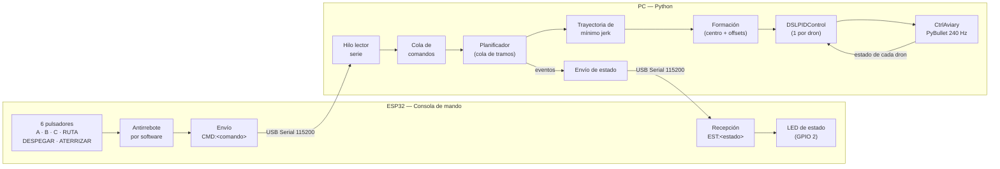

# Taller Segundo Corte — Microcontroladores

Control de robots simulados en PyBullet mediante consolas de mando construidas con una **ESP32**.

| Punto | Descripción | Estado |
|---|---|---|
| [a](#punto-a--enjambre-de-drones-a--b--c) | Mover un enjambre de drones de un lugar A a B y a C, con el control gestionado desde la ESP32 | ✅ |
| b | Consola de mandos para el robot Baxter: movimiento de brazos, posicionamiento y agarre de un objeto | 🚧 |
| c | Consola de mandos para el robot Atlas | 🚧 |

```
Taller-Segundo-Corte/
├── README.md
└── punto_a/
    ├── esp32_consola_drones/
    │   └── esp32_consola_drones.ino   # Firmware de la consola (Arduino IDE)
    ├── drones_esp32.py                # Simulación + planificador + enlace serie
    └── requirements.txt
```

---

## Punto A — Enjambre de drones A → B → C

Repositorio base: [utiasDSL/gym-pybullet-drones](https://github.com/utiasDSL/gym-pybullet-drones)

<!-- 📹 Video del funcionamiento: reemplazar por el enlace al video -->
> 📹 **Video:** _(agregar enlace)_

### 1. Arquitectura



**Toda la decisión de a dónde ir sale de la ESP32**: la PC no se mueve sola, solo ejecuta los comandos que llegan por el puerto serie y le devuelve a la ESP32 el estado del enjambre para que lo muestre en el LED.

### 2. Hardware

| Pulsador | GPIO ESP32 | Comando enviado | Acción |
|---|---|---|---|
| 1 | 13 | `CMD:A` | Ir al lugar A |
| 2 | 14 | `CMD:B` | Ir al lugar B |
| 3 | 27 | `CMD:C` | Ir al lugar C |
| 4 | 32 | `CMD:RUTA` | Recorrido automático A → B → C |
| 5 | 18 | `CMD:DESPEGAR` | Subir a la altura de crucero (1 m) |
| 6 | 33 | `CMD:ATERRIZAR` | Bajar en el lugar actual |
| LED | 2 (LED de la placa) | — | Estado del enjambre |

Cada pulsador va **entre su GPIO y GND**. Se usa `INPUT_PULLUP`, así que no hacen falta resistencias externas (suelto = `HIGH`, presionado = `LOW`). Se evitaron los GPIO 0, 2, 12 y 15 (pines de arranque) y 34–39 (no tienen pull-up interno). Los botones de RUTA y DESPEGAR estaban en los GPIO 26 y 25, pero en las pruebas no respondieron con la placa usada, así que se pasaron al 32 y al 18.

| LED de estado | Significado |
|---|---|
| Apagado | Drones en tierra |
| Parpadeando | Drones moviéndose |
| Encendido fijo | Drones en el aire, quietos (despegaron o llegaron a A/B/C) |

### 3. Protocolo de comunicación

Mensajes de texto terminados en `\n`, por USB Serial a 115200 baudios:

| Sentido | Mensaje | Cuándo |
|---|---|---|
| ESP32 → PC | `CMD:A`, `CMD:B`, `CMD:C`, `CMD:RUTA`, `CMD:DESPEGAR`, `CMD:ATERRIZAR` | Al presionar un pulsador (una vez por pulsación) |
| PC → ESP32 | `EST:MOVIENDO` | Empieza un movimiento |
| PC → ESP32 | `EST:LLEGO:A` / `B` / `C` | La formación llegó a un lugar |
| PC → ESP32 | `EST:EN_AIRE` | Terminó de despegar |
| PC → ESP32 | `EST:EN_TIERRA` | Terminó de aterrizar |

Se eligió texto plano (en vez de bytes) porque se puede depurar desde el Monitor Serie del Arduino IDE escribiendo los mensajes a mano.

### 4. Análisis del desarrollo

**Firmware ESP32**

- *Antirrebote por software:* cada pulsador guarda su última lectura y el instante del último cambio; solo se acepta un nuevo estado si se mantiene estable más de 40 ms. El comando se envía únicamente en el **flanco de bajada**, así mantener presionado un botón no envía comandos repetidos.
- *Todo es no bloqueante* (sin `delay()`): en cada `loop()` se leen botones, se procesan los bytes que lleguen por serie y se actualiza el LED con `millis()`. Así la consola nunca pierde una pulsación mientras parpadea el LED.

**Programa en Python**

- *Hilo lector serie:* `readline()` es bloqueante, por eso corre en un hilo aparte que mete los comandos en una `queue.Queue`. El lazo de simulación solo vacía la cola en cada paso, sin frenarse.
- *Planificador con cola de tramos:* cada comando se convierte en uno o más tramos (destinos). Si se pide ir a B estando en tierra, el planificador agrega primero el despegue automáticamente. Si se presionan varios botones seguidos, los tramos se ejecutan en orden.
- *Formación:* los 9 drones se organizan en una rejilla de 3×3 separados 0,35 m. Solo se planea la trayectoria del **centro** de la formación; cada dron sigue `centro + offset`, por eso nunca se cruzan.
- *Movimiento fluido — trayectoria de mínimo jerk:* entre el punto inicial y el destino se usa
  `s(τ) = 10τ³ − 15τ⁴ + 6τ⁵`, con `τ = t/T`. Este polinomio arranca y termina con velocidad y aceleración cero, lo que evita los tirones de un cambio brusco de referencia. Además se le pasa al PID la velocidad deseada (`target_vel`) para que siga la trayectoria sin retraso. La duración `T` sale de la distancia y una velocidad media de 0,5 m/s (mínimo 2 s).
- *Control:* cada dron tiene su propio `DSLPIDControl` del repositorio, que calcula las RPM de los 4 motores a 48 Hz; la física corre a 240 Hz.

**Lugares definidos** (centro de la formación, altura de crucero 1 m)

| Lugar | x [m] | y [m] |
|---|---|---|
| A (inicio) | 0,0 | 0,0 |
| B | 2,0 | 0,0 |
| C | 1,0 | −1,5 |

Se pueden cambiar en el diccionario `LUGARES` al inicio de `drones_esp32.py`.

**Resultados de la prueba** (comando `RUTA` y luego `ATERRIZAR`, 9 drones):

| Evento | Tiempo | Centro real de la formación | Error máx. de un dron |
|---|---|---|---|
| Llegó a A (tras despegar) | 4,0 s | (0,00; 0,00; 1,00) | 0,0 cm |
| Llegó a B | 8,0 s | (2,03; 0,00; 1,00) | 3,9 cm |
| Llegó a C | 11,7 s | (0,98; −1,53; 1,00) | 4,2 cm |
| Aterrizó | 32,0 s | (1,00; −1,50; 0,08) | 2,1 cm |

El error máximo de seguimiento durante todo el vuelo fue de 6,1 cm.

### 5. Paso a paso

**Paso 1 — Cargar el firmware en la ESP32**

1. Abrir `punto_a/esp32_consola_drones/esp32_consola_drones.ino` en el Arduino IDE.
2. Placa: *ESP32 Dev Module*. Seleccionar el puerto y subir.
3. (Opcional) Abrir el Monitor Serie a 115200: al presionar cada botón debe aparecer `CMD:A`, `CMD:B`, etc. **Cerrar el Monitor Serie antes del paso 3**, porque el puerto solo lo puede usar un programa a la vez.

**Paso 2 — Instalar el entorno de simulación**

> ⚠️ La versión actual de `gym-pybullet-drones` requiere **Python 3.12 o superior**.

```bash
git clone https://github.com/utiasDSL/gym-pybullet-drones.git
cd gym-pybullet-drones
pip install -e .
cd ..
pip install -r punto_a/requirements.txt
```

En Windows, si `pybullet` falla al compilar, instalar las *Microsoft C++ Build Tools* (carga de trabajo "Desarrollo para el escritorio con C++") o usar `conda install -c conda-forge pybullet`.

**Paso 3 — Ejecutar**

```bash
# Windows (ver el puerto en el Administrador de dispositivos)
python punto_a/drones_esp32.py --puerto COM5

# Linux
python punto_a/drones_esp32.py --puerto /dev/ttyUSB0
```

Se abre la ventana de PyBullet con los 9 drones en A y los lugares marcados con líneas y letras de color. Desde ese momento se controla con los botones de la ESP32.

**Opciones útiles**

| Opción | Uso |
|---|---|
| `--sin_esp32` | Probar sin la placa, usando las teclas **1–6** en la ventana (mismo orden que los botones) |
| `--demo` | Ejecuta la ruta A → B → C apenas inicia |
| `--num_drones N` | Cambiar la cantidad de drones (por defecto 9) |

### 6. Código

- [`esp32_consola_drones.ino`](punto_a/esp32_consola_drones/esp32_consola_drones.ino): lectura de pulsadores con antirrebote, envío de comandos y LED de estado.
- [`drones_esp32.py`](punto_a/drones_esp32.py): funciones `offsets_formacion` (rejilla), `minimo_jerk` (trayectoria), clase `Planificador` (comandos → tramos), clase `EnlaceESP32` (hilo serie) y `main` (lazo de simulación y control).

Ambos archivos están comentados por bloques.
